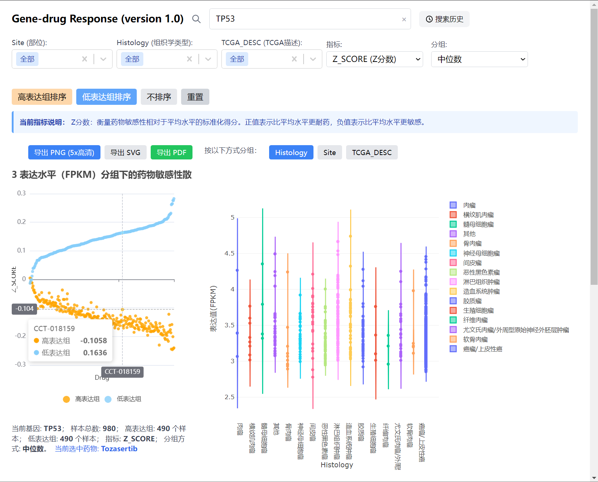
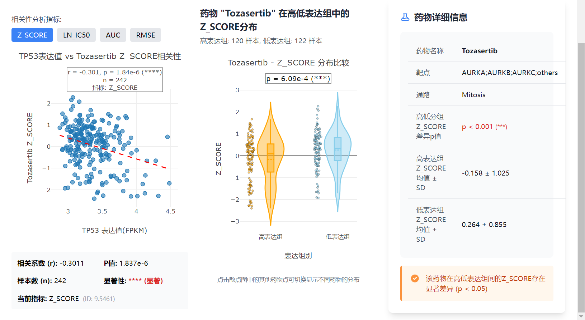

[](README.en.md)
[](README.md)

# Gene Drug Visualizer

An interactive desktop application for exploring gene expression and drug sensitivity relationships, powered by data from the **GDSC (Genomics of Drug Sensitivity in Cancer)** project.

## Features

- **Gene Search** — Search gene names with autocomplete suggestions
- **Correlation Scatter Plot** — Visualize expression vs drug sensitivity for any gene and metric
- **Violin Plot** — Expression distribution grouped by tissue, histology, or TCGA classification
- **Drug Response Analysis** — Explore IC50, AUC, RMSE, and Z_SCORE metrics
- **Interactive Interface** — Built with React and Plotly for rich, responsive charts

## Screenshots





## Download

Pre-built Windows installers are available on the [Releases page](https://github.com/bingshaowei/GeneDrugVisualizer/releases).

**Requirements:**
- Windows 10 / 11 (64-bit)
- No additional software required — Python 3.11 and all dependencies are bundled

## Documentation

- [User Manual (Chinese)](docs/用户手册.pdf)
- [Software Copyright Certificate (Chinese)](docs/软件证书.pdf)

## Development

### Prerequisites

- Node.js 18+ and npm
- Python 3.11

### Quick Start

```bash
# Clone the repository
git clone https://github.com/bingshaowei/GeneDrugVisualizer.git
cd GeneDrugVisualizer

# Install frontend dependencies
cd frontend && npm install && cd ..

# Start the Flask backend
cd backend
python -m pip install -r requirements.txt
python app.py &
cd ..

# Start the frontend dev server
cd frontend && npm start
```

### Build Installer

```powershell
# One-click build (recommended)
scripts\build.bat

# Or step by step:
# 1. Build frontend
cd frontend
npm install && npm run build
cd ..

# 2. Prepare electron directory
xcopy /E /I /Y frontend\build electron\backend\build
xcopy /Y backend\app.py electron\backend\
xcopy /Y backend\requirements.txt electron\backend\
xcopy /E /I /Y backend\data electron\backend\data

# 3. Download Python embedded
scripts\download-python.bat

# 4. Build Electron installer
cd electron
npm install
npx electron-builder --win
```

### Data Source

Expression and drug sensitivity data are from the **GDSC (Genomics of Drug Sensitivity in Cancer)** v2 project:

- [GDSC Website](https://www.cancerrxgene.org/)
- Dose-response curves: GDSC2 fitted dose-response (27Oct23 release)
- Gene expression: RNA-seq data

## Tech Stack

| Layer | Technology |
|-------|-----------|
| Frontend | React 18, Plotly.js, Tailwind CSS |
| Backend | Python 3, Flask |
| Desktop Shell | Electron 27, electron-builder |
| Charts | Plotly, ECharts |
| Data Processing | Pandas (CSV) |

## License

MIT License — see [LICENSE](LICENSE)
