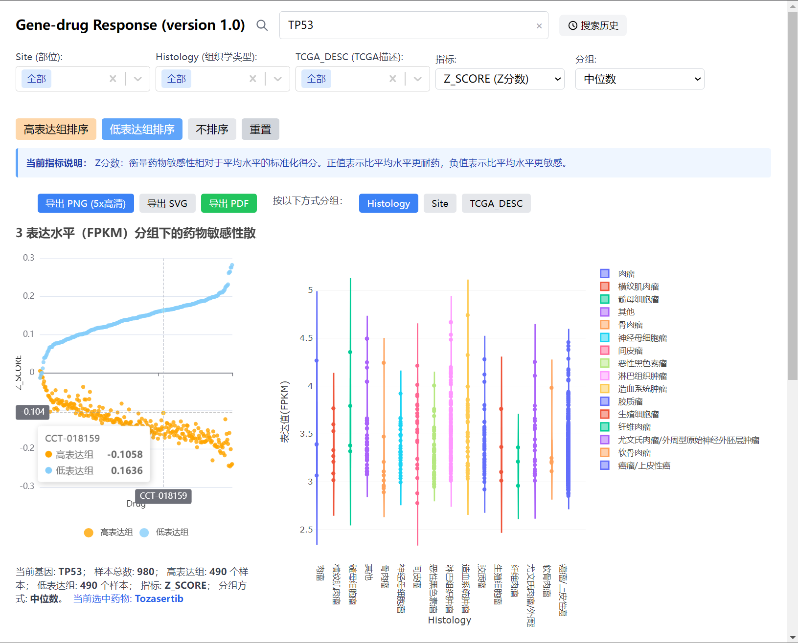
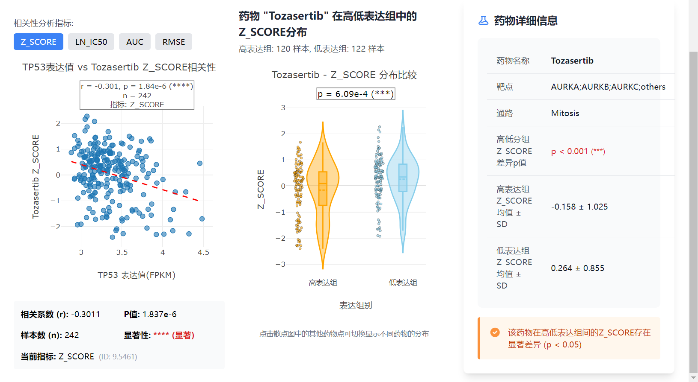

[](README.en.md)
[](README.md)

# Gene Drug Visualizer

交互式桌面应用，用于探索基因表达与药物敏感性之间的关系，数据来自 **GDSC（Genomics of Drug Sensitivity in Cancer）** 项目。

## 功能

- **基因搜索** — 输入基因名称，自动补全匹配
- **相关性散点图** — 任意基因 + 任意指标，可视化表达量与药物敏感性的关系
- **小提琴图** — 按组织 / 组织学分类 / TCGA 分组展示表达量分布
- **药物响应分析** — 查看 IC50、AUC、RMSE、Z_SCORE 等指标
- **交互式界面** — 基于 React + Plotly，图表可缩放、悬停查看详情

## 界面预览





## 下载

Windows 安装程序请前往 [Releases 页面](https://github.com/bingshaowei/GeneDrugVisualizer/releases) 下载。

**系统要求：**
- Windows 10 / 11（64 位）
- 无需额外安装软件 — Python 3.11 及所有依赖已内置

## 文档

- [用户手册](docs/用户手册.pdf)
- [软件著作权证书](docs/软件证书.pdf)

## 开发

### 前置要求

- Node.js 20.19+、22.12+ 或更高版本，以及 npm 11+
- Python 3.11

### 快速开始

```bash
# 克隆仓库
git clone https://github.com/bingshaowei/GeneDrugVisualizer.git
cd GeneDrugVisualizer

# 安装前端依赖
cd frontend && npm install && cd ..

# 启动 Flask 后端
cd backend
python -m pip install -r requirements.txt
python app.py &
cd ..

# 启动前端开发服务器
cd frontend && npm start
```

前端开发服务器使用 Vite，固定监听 `http://127.0.0.1:3000`，并将 API 请求代理到本地 Flask 服务 `http://127.0.0.1:5000`。

### 构建安装包

```powershell
# 一键构建（推荐）
scripts\build.bat

# 或手动分步执行：
# 1. 构建前端
cd frontend
npm install && npm run build
cd ..

# 2. 准备 Python 嵌入版及固定依赖
scripts\download-python.bat

# 3. 打包（electron-builder 直接收集 backend 与 frontend/build）
cd electron
npm install
npx electron-builder --win
```

应用主图标位于 `electron/build/icon.png`，Electron Builder 会在打包时生成 Windows 所需图标格式。安装包输出到 `electron/dist`。

### 数据说明

基因表达和药物敏感性数据来自 **GDSC（Genomics of Drug Sensitivity in Cancer）** v2 项目：

- [GDSC 官网](https://www.cancerrxgene.org/)
- 剂量响应曲线：GDSC2 fitted dose-response（2023年10月27日版）
- 基因表达：RNA-seq 数据

## 技术栈

| 层 | 技术 |
|----|------|
| 前端 | React 18, Vite 8, Plotly.js, Tailwind CSS |
| 后端 | Python 3, Flask |
| 桌面壳 | Electron 27, electron-builder |
| 图表 | Plotly, ECharts |
| 数据处理 | Pandas (CSV) |

## 许可证

MIT License — 详见 [LICENSE](LICENSE)
